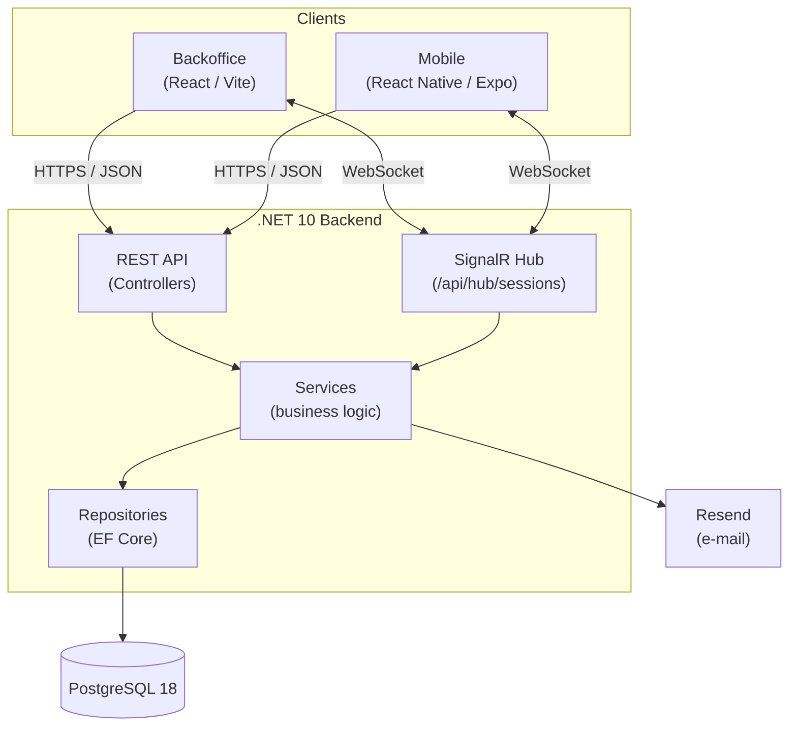

# iO Event Connect — Technisch Plan

> Dit document beschrijft de technische architectuur en componenten.

## 1. Inleiding

Het systeem is opgezet als een **monorepo** met drie applicaties die één gedeelde backend-API gebruiken:

| Onderdeel      | Technologie                      | Doelgroep              |
|----------------|----------------------------------|------------------------|
| **Backend**    | C# / .NET 10 (ASP.NET Core)      | API voor beide clients |
| **Backoffice** | React 19 + React Router 7 (Vite) | Organisatoren          |
| **Mobile**     | React Native + Expo (SDK 55)     | Deelnemers             |
| **Database**   | PostgreSQL 18                    | Persistente opslag     |

De monorepo-opzet is bewust gekozen: backend en clients delen automatisch gegenereerde TypeScript-types (zie §6),
waardoor het datacontract over alle onderdelen consistent blijft.

## 2. Architectuuroverzicht

Beide clients communiceren met dezelfde backend via een **REST API** (request/response) en via **SignalR** (realtime).
De backend is de enige component die rechtstreeks met de database praat.



De API en de SignalR-hub delen dezelfde authenticatie (JWT) en dezelfde servicelaag, zodat business-logica niet wordt
gedupliceerd tussen request/response- en realtime-communicatie.

## 3. Backend

De backend is een ASP.NET Core-applicatie verdeeld over drie projecten binnen één solution (`Backend.sln`):

| Project            | Verantwoordelijkheid                                                                  |
|--------------------|---------------------------------------------------------------------------------------|
| `Backend.Web`      | API: controllers, services, DTO's, validatie, SignalR-hubs, configuratie              |
| `Backend.Database` | Persistentie: entiteiten, EF Core `DbContext`, configuraties, repositories, migraties |
| `Backend.Tests`    | Unit tests                                                                            |

### 3.1 Gelaagde architectuur

Een request doorloopt vaste lagen, elk met een eigen verantwoordelijkheid:

```
Controller  →  Service  →  Repository  →  EF Core  →  PostgreSQL
   (HTTP)     (business)    (data access)
```

- **Controller** — vertaalt HTTP naar aanroepen, handelt autorisatie af en geeft DTO's terug. Bevat geen
  business-logica.
- **Service** — bevat de business-regels (bijv. controle op overlappende sessies of volle capaciteit) en orkestreert
  repositories.
- **Repository** — kapselt alle databasetoegang in achter een interface (`ISessionRepository`, `IEventRepository`, …),
  zodat services testbaar zijn en niet afhankelijk van EF Core.

Deze scheiding maakt elke laag los testbaar en houdt de afhankelijkheden in één richting (controller kent service,
service kent repository, maar niet andersom).

### 3.2 Feature-based indeling

Binnen `Backend.Web/Features` is de code per **domein-feature** georganiseerd in plaats van per technisch type. Elke
feature bundelt zijn eigen controller, service, DTO's, validators, mappings en exceptions.

Voordeel: alles wat bij één onderwerp hoort staat bij elkaar, wat het toevoegen van features en het onderhoud
overzichtelijk houdt. De mappenstructuur in `features/` van de clients volgt bewust hetzelfde patroon, zodat de
structuur over de hele stack herkenbaar is.

### 3.3 Persistentielaag

`Backend.Database` gebruikt **Entity Framework Core** met de **Npgsql**-provider voor PostgreSQL. De indeling:

- **Entities** — de domeinmodellen als C#-klassen.
- **Persistence/Configurations** — per entiteit een `IEntityTypeConfiguration` die kolommen, relaties en constraints
  vastlegt (fluent API in plaats van data-annotations).
- **Migrations** — het versiebeheer van het databaseschema (auto-generated).

Datum/tijd-velden gebruiken **NodaTime** (`LocalDateTime`, `LocalDate`) in plaats van `DateTime`. Dat voorkomt
tijdzone-ambiguïteit bij sessieroosters: een sessie om 10:00 is lokaal 10:00, ongeacht de tijdzone van de server of de
client.

### 3.4 Cross-cutting concerns

Een aantal zaken zijn centraal geregeld in `Backend.Web/Configuration`, zodat features ze niet zelf hoeven te
implementeren:

- **Validatie** — FluentValidation-validators per DTO, centraal afgedwongen via een `ValidationActionFilter`.
- **Foutafhandeling** — een `GlobalExceptionHandler` zet exceptions om naar gestandaardiseerde `ProblemDetails`
  -responses.
- **Serialisatie** — JSON in camelCase, enums als strings, NodaTime-aware.
- **CORS** — alleen de geconfigureerde origins (zoals de backoffice op `http://localhost:5173`) mogen de API benaderen.

## 4. Authenticatie & autorisatie

Authenticatie verloopt via **ASP.NET Core Identity** in combinatie met **JWT bearer tokens**:

- Bij login geeft de backend een kortlevend **access token** (JWT) en een **refresh token** uit. Het refresh token wordt
  server-side opgeslagen (`RefreshToken`-entiteit) zodat sessies kunnen worden ingetrokken.
- Autorisatie werkt op basis van twee rollen: **`manager`** (organisator, mag beheren) en **`attendee`** (deelnemer).
  Endpoints worden beveiligd met `[Authorize(Roles = …)]`.
- Daarnaast geldt op evenement-niveau een `EventParticipantAuthorizationFilter`, die controleert of de gebruiker
  daadwerkelijk aan het betreffende evenement deelneemt voordat sessies zichtbaar zijn.

Omdat WebSockets geen `Authorization`-header meesturen, accepteert de backend voor hub-verbindingen het JWT ook via de
`access_token`-querystring (alleen op `/api/hub/`-paden). Zo gebruiken REST en SignalR hetzelfde token.

## 5. Realtime communicatie (SignalR)

Voor live-updates gebruikt het platform **SignalR** over WebSockets. De `SessionsHub` (`/api/hub/sessions`) duwt
wijzigingen in sessie-inschrijvingen direct naar verbonden clients, zodat bijvoorbeeld de resterende capaciteit van een
sessie in realtime meebeweegt zonder dat de client hoeft te pollen.

De business-logica voor inschrijvingen leeft in de servicelaag; de hub en de REST-controller roepen dezelfde service
aan. Daardoor blijft er één bron van waarheid voor het in- en uitschrijven, ongeacht via welk kanaal het binnenkomt.

## 6. Gedeeld datacontract (TypeGen)

Een keuze van de architectuur is het automatisch genereren van TypeScript-types uit de C#-DTO's met **TypeGen**.
Bij het builden van de backend worden de types weggeschreven naar `generated-types/` in zowel de Backoffice als de
Mobiele app.

Hierdoor:

- bestaat er één bron van waarheid voor het API-contract (de C#-DTO's);
- leveren wijzigingen aan een DTO direct compile-fouten op in de clients als die niet meekomen;
- hoeven types niet handmatig te worden overgetypt, wat fouten en drift voorkomt.

Dit is de belangrijkste reden dat de drie applicaties in één monorepo leven.

## 7. Frontend — Backoffice (web)

De backoffice is een **React 19**-applicatie met **React Router 7** als framework, gebuild met **Vite**. De indeling:

```
Backoffice/app/
├── routes/         # pagina's per feature (events, sessions, rooms, speakers, participants, dashboard)
├── components/     # gedeelde componenten, incl. ui/ (shadcn/ui)
├── layouts/        # dashboard-layout, sidebar, navigatie
├── contexts/       # React context (o.a. geselecteerd evenement)
├── lib/            # api-client (axios), signalr-client, auth, validatie, form-helpers
└── generated-types/ # door TypeGen gegenereerde API-types
```

De UI is gebouwd met **shadcn/ui** componenten op Tailwind CSS. Formulieren gebruiken React Hook Form met Zod-validatie;
datatabellen gebruiken TanStack Table. Communicatie met de backend loopt via een centrale axios-client (`api-client.ts`)
en een SignalR-client (`signalr-client.ts`).

## 8. Frontend — Mobile (app)

De mobiele app is gebouwd met **Expo** en **React Native**, met **Expo Router** voor file-based routing. De
`features/`-indeling spiegelt die van de backend, elk met een eigen `api.ts` en `types.ts`.

De app gebruikt dezelfde axios- en SignalR-clientopzet als de backoffice. Styling gebeurt met **NativeWind** (Tailwind
voor React Native) en de **React Native Reusables** componentbibliotheek — de mobiele tegenhanger van shadcn/ui.
Deelnemers loggen in, bekijken het programma, stellen een persoonlijke agenda samen en scannen QR-codes.

## 9. Build, test & deployment

### 9.1 CI/CD

Per component is er een **GitHub Actions**-workflow die op pull requests draait:

| Workflow            | Trigger (paden) | Stappen                                               |
|---------------------|-----------------|-------------------------------------------------------|
| `backend-pr.yml`    | `Backend/**`    | restore → build (Release) → `dotnet test`             |
| `backoffice-pr.yml` | `Backoffice/**` | `npm ci` → typecheck → build                          |
| `mobile-pr.yml`     | `Mobile/**`     | `npm ci` → TypeScript-validatie → bundle export check |

### 9.2 Containerisatie

Zowel `Backend.Web` als de `Backoffice` hebben een `Dockerfile`. Voor lokale ontwikkeling start een `docker-compose.yml`
een PostgreSQL 18-container. De backend voert bij het opstarten zelf de migraties en seeding uit, zodat een verse
database direct bruikbaar is.

## 10. Gerelateerde documentatie

- [Installatiehandleiding](./INSTALLATIE.md)
- [Backend README](../Backend/README.md) — SignalR, TypeGen en migraties in detail
- [Backoffice README](../Backoffice/README.md) — projectstructuur en editor-setup
- [Mobile README](../Mobile/README.md) — navigatie, SignalR en styling
