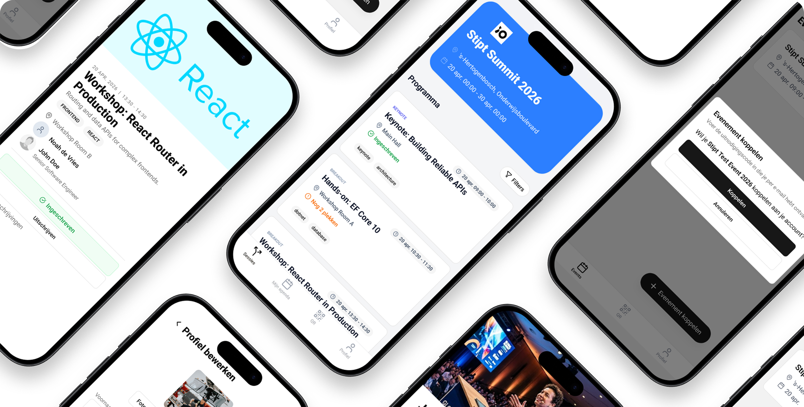

# Event Connect

A real-time platform for modern events. Attendees browse the program and register for sessions through a mobile app, while organizers manage sessions, speakers, and rooms, and get real-time insight into how their event is performing, through a web backoffice.

Built for a real client as part of a professional software development engagement, with a small team acting as both developers and primary stakeholder contacts throughout the project.

## My Contribution

I was the team's main point of contact with the client throughout the project. I ran every sprint review with the product owner, presenting the work and walking through the demo each time, and translated client feedback into scoped, estimated backlog items, such as breaking a client-requested registration flow into account creation, invitation, and event-linking tasks, and proposing a scope split across sprints to stay within the team's velocity.

I also led the final handover: I coordinated the closing sprint review demo and delivered the installation guide, a documented list of known limitations, and the technical research report to the client and the agency taking over development.

## Documentation
- [Installation guide](./.docs/INSTALLATIE.md)
- [Technical plan](./.docs/TECHNISCH-PLAN.md)
- [Backend](./Backend/README.md)
- [Backoffice](./Backoffice/README.md)
- [Mobile](./Mobile/README.md)

## Stack
| Layer | Tech | CI |
|---|---|---|
| Backoffice | React (React Router) |  |
| Mobile app | React Native (Expo) |  |
| Backend API | .NET & PostgreSQL |  |

---
Team Stipt: Robin Dera, Pepijn Emmers, Sven Lempers, Mark Schuurmans, Miel van der Velden, Daan Wennekes
